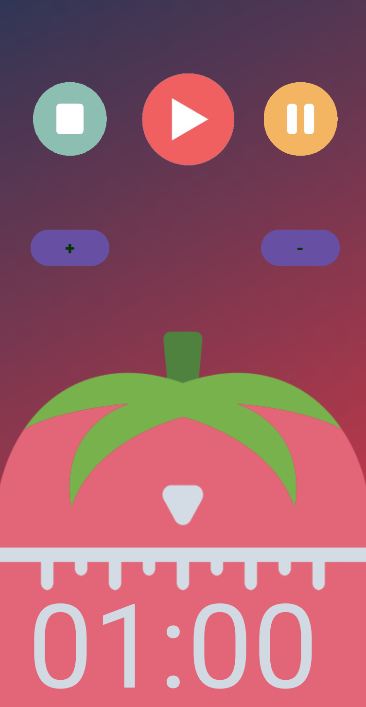

# beautiful-pomodoro 🍅

Pomodoro timer Android app 
Coded in Java ☕ 
Uses separate threads for the interface and the timer ğŸ–¥ï¸ 
Runs in the background ⚙️ 
User can switch to a different app or turn off the screen and the timer will keep running

